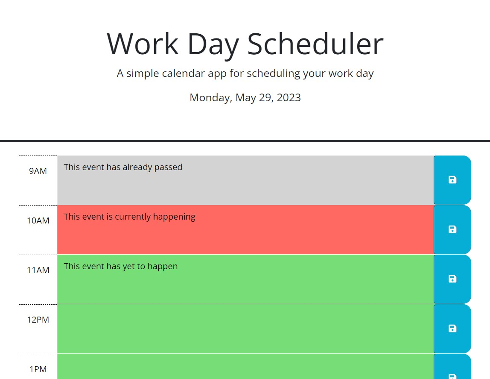

# Work Day Scheduler

## Description
* A browser ran calendar application that features dynamically updated HTML and CSS powered by jQuery. 
* User's are able to save events for each hour of the day.
* Work Day Scheduler is great for individuals with busy schedules who need a way to organize the appointments that they have for the day.
* The UI featured in Work Day Scheduler, such as the color-coded time blocks, makes it easy to differentiate the user's events for the day based on the current hour.

## Installation
1. Run the Work Day Scheduler either through the [deployed GitHub Page](https://averyjmiller.github.io/work-day-scheduler/) or on your local machine. *Note: If you are choosing to run the application on your local machine, you must run it with a live server.*

## Usage
1. Time blocks are color-coded based on the current hour of the day.
    * Gray - this event has passed already
    * Red - this event is currently happening
    * Green - this event has yet to happen
2. Click on your desired time block and type the events that are within that hour of the day
3. Click the save icon to the right of the time block to save your event to ```local storage```
---


## Credits
**Third-Party APIs**
* [Bootstrap v5.1.3](https://getbootstrap.com/docs/5.1/getting-started/introduction/)
* [jQuery v3.4.1](https://jquery.com/download/)
* [Day.js v1.11.3](https://day.js.org/docs/en/installation/browser)
* [Font Awesome v5.8.1](https://fontawesome.com/start)
* [Google Fonts](https://fonts.google.com/)

## License
Please refer to the ```LICENSE``` in the repo.
